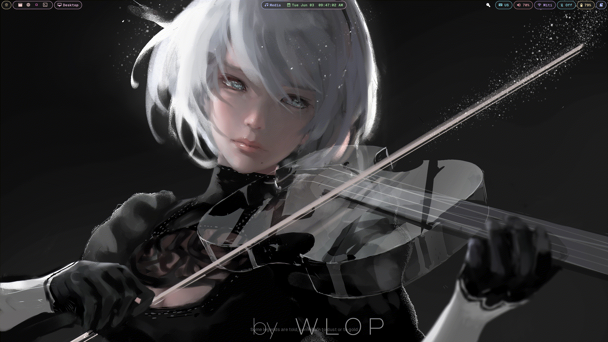

# 🌌 Hypaurora

Welcome to my **dotfiles** repository! 🎉 These are my personal configuration files for setting up and customizing the GNOME and Hyprland.

> If you want to use this make sure you clone it in `~/Documents/hypaurora`



-  Icon Pack: [Color Flow](https://www.gnome-look.org/p/2239645)
-  Cursor Theme: [Phinger HyprCursor Light](https://discord.com/channels/961691461554950145/1216066899729977435/1326665055844175892)
-  Font Family: [Geist](https://vercel.com/font)
-  Persian Font Family: [Vazirmatn](https://rastikerdar.github.io/vazirmatn/en)
-  Monospace Family: [Geist Mono](https://vercel.com/font)
-  Persian Monospace Family: [AzarMehrMonospace](https://befonts.com/azarmehr-monospaced-font-duo.html)

## Color pallet

Basically catppuccin mocha with these colors modified for being easier on the eyes:

```
Base
 #1a1a1a     rgb(26, 26, 26)
Mantle
 #161616     rgb(22, 22, 22)
Crust
 #0f0f0f     rgb(15, 15, 15)
```

## What's Included? 🤔

> Many things!

---

Happy customizing! If you run into any issues or have questions, don't hesitate to open an issue or reach out. May your Hyprland lite setup be ever in your favor! 🌟

---

This dotfiles also a have a more beautiful and fancy design, checkout main branch
